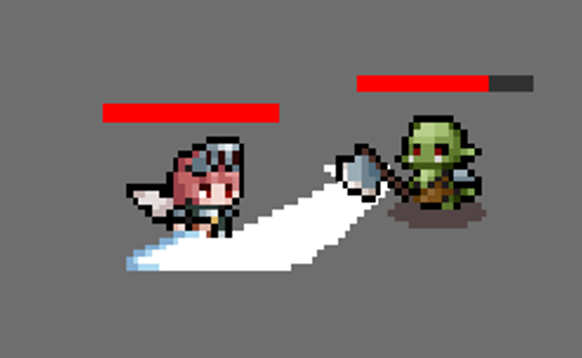
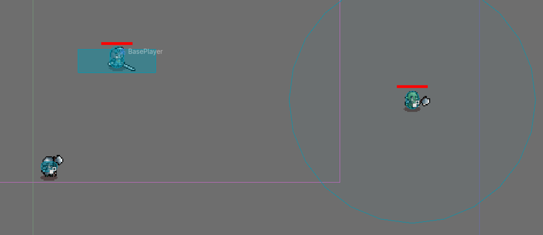

Some of the past week's work is boilerplate, but the game is beginning to take shape.
It is interesting to work with other motivated students because I am used to working alone.
A feature on our task list happens to be executed well by a teammate when I was stressing over how to implement it myself.

We all teach each other here and there, and this week I offered some pointers to my teammates.

## Tasks I Worked On

- Refactored player movement and input code
- Refactored enemy movement and targeting system/switching
- Code documentation
- Cleaned up the InputMap
- General cleanup in the repository (folder structure, README, etc.)
- ⭐ Assets!

Assets is the big one. A while ago I paid $2 for the
[Tiny RPG Character Asset Pack](https://zerie.itch.io/tiny-rpg-character-asset-pack),
which another team is also using.
No more Godot logo icons!
No more sliding PNGs!

### Gallery

    
<i>Expand to see Gallery photos.</i>

    

    

### Pull Request?

Since we're exercising trunk-based development with a single branch,
pull requests aren't really possible
(unless I'm mistaken, in which case please let me know).

That said, I have gathered the
[commits](https://github.com/KxtR-27/CS414_SaveTheIdiot/commits/main/?author=KxtR-27&since=2026-09-05&until=2026-09-08)
I've pushed within the past week.
You can only see them if you have access to the private repository though.

## Estimated Time vs. Actual Time

I **estimated** that I would spend about **_six hours_** this week setting up the project conventions, configurations, bug fixes, and assets.

I **spent** about **_seven hours_** on it this week, with the extra time coming from the need to reimplement a broken feature another teammate had pushed (no shade though).

## Struggles Along the way

- I had to fix a lot of bugs.
- I had to adapt others' code to follow GDScript and Godot best practices.
- I had to reimplement a couple features that other teammates made.

- When I had finally fixed it all, a teammate--through no fault of their own--committed and pushed something new
  that created so many merge conflicts that I could no longer tell what was going on.
  I had to discard all changes and restart from the top.
  At least the second time was faster.

To address these, I shared links to useful Godot documentation pages;
provided detailed reports of what I fixed, how I fixed it, and why;
and I added some documentation of my own to the project.

    
<b>Commits related to rectifying the struggles</b>

    <ul>
        <li><a href="https://github.com/KxtR-27/CS414_SaveTheIdiot/commit/c4a6ca659e66074d47fb32392826f93e51208d81">Refactor file names and structure, add class names</a></li>
        <li><a href="https://github.com/KxtR-27/CS414_SaveTheIdiot/commit/9bf163e76c4410645c71d64e9dd9ad2bbd082b83">Refactor BasePlayer for style and pitfalls</a></li>
        <li><a href="https://github.com/KxtR-27/CS414_SaveTheIdiot/commit/03b71c96d605d5db4b888744913ad57af317c0e7">Refactor BaseEnemy for style and pitfalls</a></li>
        <li><a href="https://github.com/KxtR-27/CS414_SaveTheIdiot/commit/befc5268f39d2a295192164c91b2ba680389fe88">Document BaseEnemy changes</a></li>
        <li><a href="https://github.com/KxtR-27/CS414_SaveTheIdiot/commit/c5f9031fd46f43e72177a65b5d35abd4dfbed050">Further document BasePlayer</a></li>
        <li><a href="https://github.com/KxtR-27/CS414_SaveTheIdiot/commit/d219bd7194bc9e8141430782004b8c78bc9edab7">Add more Useful Links to README</a></li>
    </ul>

## Okay, what's next?

We're gunning for a playable demo within the next week.
We need to add our VIP with the ability to die, flee, and follow.
We need a wave/round system and an enemy spawning system.

You'll just have to wait and see!
