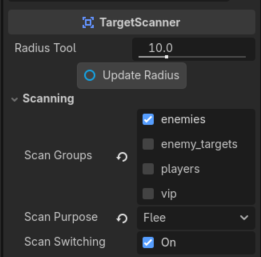
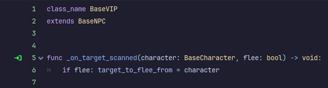
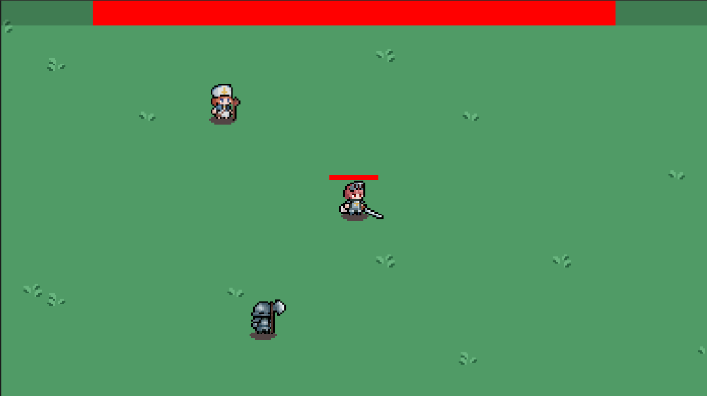
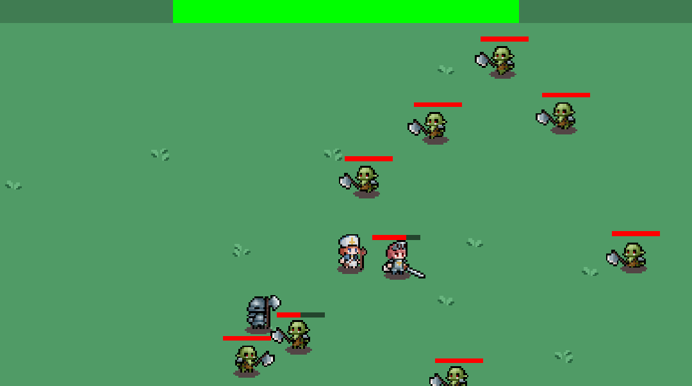
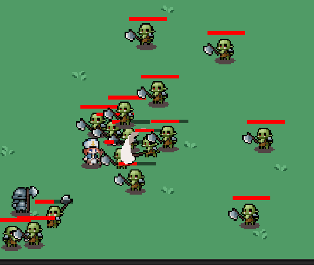
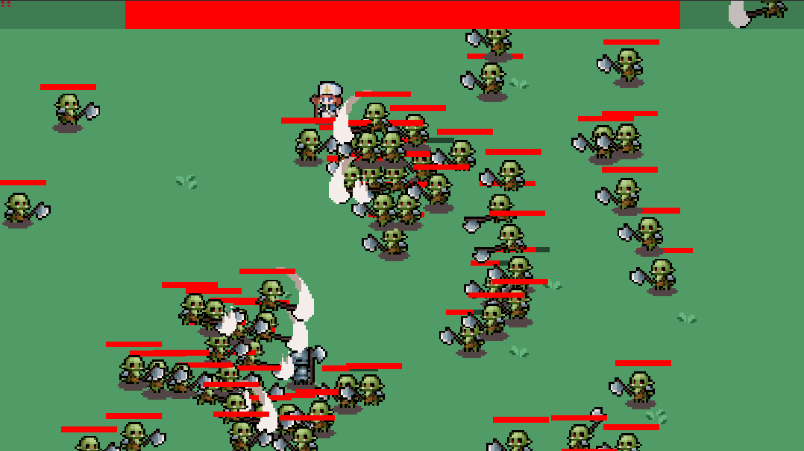

## Tasks worked on

_(No PRs, but there are plenty of [commits](https://github.com/KxtR-27/CS414_VipWaveSurvival/commits/main/?author=KxtR-27&since=2026-09-09&until=2026-09-13)
since the last journal.)_

Three big things happened this week:

1. A reconstruction of the object-class hierarchy.
2. A VIP character who flees when an enemy gets too close.
3. Some engine tools, like the `TargetScanner`

### Class Hierarchy

As I noticed myself and my teammates start to write repeated code between our player and our enemy,
I decided it would be worthwhile to create a detailed class structure that would not only remove repeated code,
but also empower us to strategically assign classes to NPCs and objects down the line.
A loose class diagram is available below.

<!-- I can't believe this actually worked -->
<iframe src="https://mermaid.live/embed?theme=redux-dark-color&look=classic&mode=dark#pako:eNqNVd9r2zAQ_leEoJBC08EeQyn0xxh7GYWWPawu7sU62yKylElyu5D1f99JtpsoiZvqybr77rvT5bvLmhdGIJ_xQoFztxIqC01mM83o3NRgofBor41Yfb1lF_-mU3YNDt8dAzIxbnB3ClZHQT_vbrYRdN34vmlsVqPeXz_uPuC-bZtmlVQ6gE9OmDYeWWnsTmDGa3CsRlC-ZqAFa8wLMrdEFBkfCw81ZRyEcGRSyrxKXcXgUiGG7znW8CKNHafoGhVYlGKtln9aZMvOBt5bOW89uq4g9LURbpwqtoyYHsBW6Lsg4oBi4XrKzkbNux9nIS9xhAfQo6xp2PM79_NI8rTfFC0MBZO7ph5sQt7xu-rK-LyVyk-lZt-NMJ5FSXaBQ3A07UWuB3c45-fnO9fJ6WB4Gz5Svh3xXFzNnQ-Xy8uU2slKg-rlkRc16Ip0sQUolQHfy2XP3IVtvyYcDwvMBTRQ4URqn5a6X2bU_2iB9yQV0puPP32-tCVa1AXu5kzf26O9yTv17ldeKOPQ-d6fC-k89LRHKUlBeRDQPmsJ1teRNmC2SRNszDk5ZY_DFD2lVIgHnSP966YjadqDbDYlLykdtTD3wZigov--AK3TZRJODKP22HxoVUe3UV5EGd3bcxd5RKjcm_6NX7opPfaCMJnrz1c2mpMaFyf7WL5-NR0aBJhLJf0qb12q96vO_vjUIyS6g0k-tzrCPBUSVLoJDq_PSdx2bN7qomamZMRAdufbstwKZBYVvoCmD1nVnkyvpxnnZ7yyUvCZty2ecfr9GwhXvs440TSY8VnGLYr271SAXUwLo8JOP8u4MmYRvbFtssj4G7EtQf82phkIrWmrms9KUI5u7VKAx_4Pt4O8_QfMGoF_" width="100%" height="480" style="border:0" loading="lazy" title="Mermaid diagram" sandbox="allow-scripts allow-same-origin allow-popups allow-popups-to-escape-sandbox"></iframe>

### VIP Character and `TargetScanner`

I'm lumping these two together because they both come into play at the same time.
The VIP's fleeing behavior is a direct result of implementing the `TargetScanner`.
You may have seen it twice above.

The `TargetScanner`, when parented to a BaseNPC, informs the parent when a valid target enters the scanner's radius.
There is no polling. There is no `_process()` check.
Thanks to signals, it's event-based.
It's also customizable!

I can now isolate all the checks that the scanner runs such that by the time it finally reaches its parent,
the parent can assume that the target is valid.

So, between the hierarchical class structure and the abstracted, compartmentalized `TargetScanner`,
here's how much code the BaseVIP has:

...That's it. That's all there is. It flees when an enemy gets near it, and that's all it takes.
This is the Godot engine working for me, instead of the other way around!

## Time investment

This did take a while, but not as long as I had figured.
I had figured that the whole-scale structural change would take at least four hours.
It took three. I spent the final hour scribbling in a background.

## Roadblocks

As with time invested, things went very smoothly.
I did have frequent issues passing all the checks within the `TargetScanner` accurately,
as at one point it became impossible to glean how a target that should be valid..._wasn't_.
But with a little trial and error combined with a lot of print statements, things turned out great.

## Teamwork vs. dreamwork

Things have been going well in this regard, too.
We had one incident involving broken code, but the team discussed what was going on,
and the team member who caused the break fixed it just as quickly.

To be honest... not to put down my preproduction group (including myself; I hold some responsibility there),
but I've been really impressed with this group.
We designate a task/feature to each person to complete by next class even if it's janky.
We go over some of the jank with the extra class time and we repeat the cycle.
It's a relief to see things get done and work together.

## Sneak peek?

To top it off, here's a few screenshots of the current code.

<i>This is nice!</i>

<i>Alright, this is getting a little tough...</i>

<i>Oh. oh no... help.</i>
