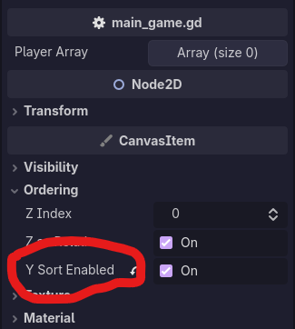
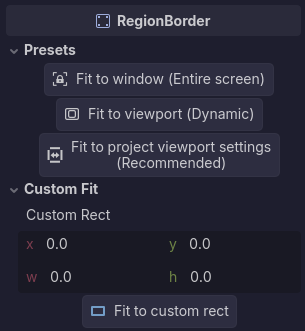
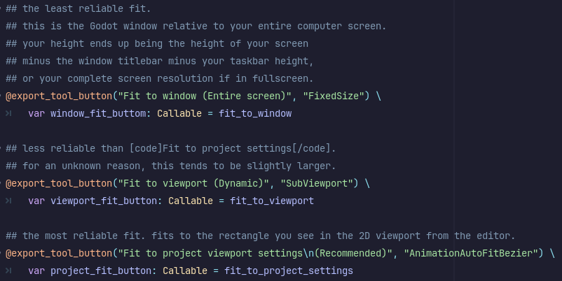

What? The actual date is two weeks later? Whaaaaaat, I have no clue what you're talking about!  
<i>Disclaimer: I do. Just pretend this was on-time.</i>

## Tasks Worked On

No PRs this week, but there are plenty of [commits](https://github.com/KxtR-27/CS414_VipWaveSurvival/commits?since=2026-09-14&until=2026-09-20&author=KxtR-27).

- VIP character follows the player when commanded
- Hurt animations
- Z-index ordering, yayyy
- Character collisions and a screen/world border

I made two important breakthroughs this week.

### Z-index, Y-sort

Originally, we had a weird issue where some characters would appear over top of others.
This got especially weird because character sprites have shadows, which would appear over top of the characters behind them.
Right when I was about to make a nightmarish process polling for setting z-indexes myself, I found this:

This makes children of the main game scene follow a simple pattern.
Rather than layering the nodes in the order of the scene hierarchy (farther up in the list shows behind nodes farther down),
Y Sort layers nodes "farther up" the **_screen_** behind nodes "farther down" the **_screen_**.
This is exactly what I was looking for.

### Collision Confusion

Speaking of the screen, there's a problem where the player and the VIP can leave it.
While there are a couple different ways to rectify this,
such as a `VisibleOnScreenNotifier2D` to detect when a character leaves the screen,
creating colliders for the bounds of the screen seems most logical.

Using a `StaticBody2D` with four `WorldBoundaryShape2D`s (one for each edge),
I created a box which characters cannot leave.
While it is somewhat strange to have four different shapes, the reason is clear.
I might be inclined to make an arbitrarily-thin rectangle shape for each end, as that is most familiar,
but it turns out that this makes collisions incredibly more expensive for the engine to calculate.
The `WorldBoundaryShape2D` was made for cases like this. 
They extend infinitely and arbitrarily, meaning a collision check has much simpler math behind it.

## Time Estimation

I estimated that my work this week would take about four hours. 
It took about three, as tasks I originally perceived as tedious or difficult (such as the z-indexing of characters)
were actually quite simple to fix. 

This meant I had an extra hour to add some cool tools, such as screen boundary snapping.

I spent a lot of time manually calculating where to place the edge boundaries when I was first making them.
Imagine how much of a pain it would be to recalculate if we changed the window size?
Imagine how much of a pain it would be if we decided that the screen should be resizable?
I took the math I did originally and made it into a function: you give me a rectangle, I snap the boundaries to it.
Everything is documented, too.

## Struggles

Collision layers and collision masks. Let's get into them. 
I never understood the difference, and the Godot documentation for it never made much sense.
Hopefully this helps you, reader, as it helped me.

**Collision layer:** the layer an object **_lives on_**.\
**Collision mask:** the layer an object **_looks for_**.

I only want my screen boundaries to collide with players and VIPs.
Calculations are cheaper that way.
But how on earth do I do that?

The system I settled on in the end was to put the boundaries on their own **_layer_**
and to take the player and VIP **_mask_** that layer.

The screen boundaries don't care what collides with them.
They're not looking to do anything with that information.
So, they get their own layer.

However, the player sits on a different layer.
They don't need to live on the boundary layer, but they *do* need to *check* for it.
By telling the player to *mask* the boundaries' layer, they will make sure that they collide when running into it.

The boundaries _live_ on their own _layer_.
The player _checks_ the equivalent _mask_ to stop when they hit the boundary.

Does that make sense? Hopefully so.

## Team Progress

Things are chugging along. I don't have much to put here.\
<i>And definitely not because I'm writing this two weeks into the future!</i>