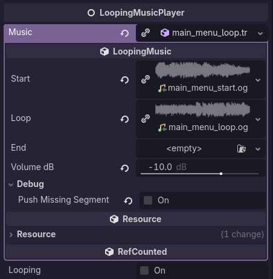
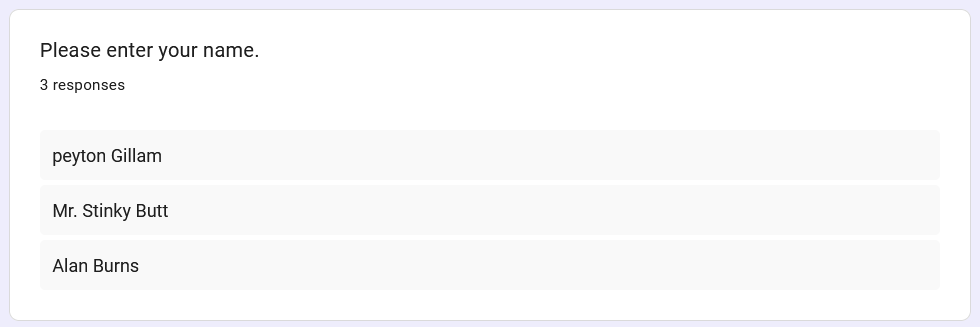

## Tasks Worked On

I did [a lot more](https://github.com/KxtR-27/CS414_VipWaveSurvival/commits?since=2026-09-28&until=2026-10-05&author=KxtR-27) this week than I remember.
I was in a rush to bring something with some Juice™ to the playtests.

- Refactored our Screen Boundary to a `RegionBorder`, conveying that it has many possible uses.
- Input device behavior refactors
- Code cleanup + bugs bugs bugs
- Sounds and music!
- GitHub bug issue template

## Time Estimation

Despite doing as much as I did, things went much faster than I imagined.
Between code cleanup, bug reports, and all the sounds and music I had to add,
I thought it would take at least five hours.
All said and done, it took four.

The sound effects (jsfxr my beloved) were rather fast to implement.
The music sucked though. I had to loop it myself.
Very nice of the composer to include a list of loop/segment timestamps though!
Check out xDeviruchi's stuff!

## A Cacophony of Struggles

Getting the music to loop correctly was a pain.
Once I put the tracks through Audacity and manually sliced it at the exact milliseconds,
exporting was straightforward enough.

Then I wrapped loopable tracks into a custom resource in Godot.
This was actually pretty cool. Resources are super underrated.



- Playing a piece starts with the `Start` segment (though technically you can start at any segment).
- Once the `Start` segment ends, the player automatically starts streaming the `Loop`.
- Once the `Loop` segment ends...
    - If `Looping`, play the `Loop` again.
    - Otherwise, if an `End` segment exists, play that instead.
- The audio player also adjusts its volume to match the setting in the resource.
- Some tracks don't have an end or don't have a start.
  By default, trying to play segments with the audio player that don't exist creates warnings.
  However, this specific track has no end, so the missing `End` segment is intentional.
  Disabling `Push Missing Segment Warnings` prevents logging these warnings to the console.
  Cool, right?

As for the player implementation...

Somehow, at first, I had it working where a single `AudioStreamPlayer` managed the resource and played automatically.
This means that the script for the `LoopingMusicPlayer` could be used as a Node type
because the logic was completely self-contained, relying on neither parent nor child nodes.
However, I accidentally used the wrong track for a second music resource and assumed that the `LoopingMusicPlayer` wasn't working.
By the time I realized that the mistake was not with my `LoopingMusicPlayer` but with the track I pointed to in the Resource,
I had already rewritten the entire thing.

I like the new system better though. The `LoopingMusicPlayer` is now a Node with a child `AudioStreamPlayer` for each segment.
This makes managing the resource much more straightforward, and signal connections are much more readable this way.
Instead of having one player and having to figure out which segment it just finished, the following is now possible:

```gdscript
func _on_start_player_finished() -> void:
	loop.play()


func _on_loop_player_finished() -> void:
	play_loop() if looping else play_end()


#func _on_end_player_finished() -> void:
	#pass
```

...which reads way better.

## Team Communication

In the time since the incident, collaboration and asking for help has been very pleasant.
The three notice each other's struggles sooner and ask how we can help.
I am respectful of the fact that both my teammates put a lot of energy into the work, and
"would you like me to handle that for you?" is the last question I ask, not the first.

Things are working much better this way, and it encourages us to learn from each other's struggles, too.

## Bonus: Playtesting Feedback

We had three students playtest.
I don't know who, but one of them apparently put "Mr. Stinky Butt" for their name.
Despite how unamused I was, Mr. Stinky Butt--along with the other two playtesters--had decent feedback.


_See??? I'm not joking!!!_

A quick synopsis:

- There is fun to be found! That was an exciting bit of feedback we received.
- The controls are confusing. Even though we have a whole menu for them on the title screen,
  only one player checked. This means that we need to make it more obvious,
  but also that we should make them visible elsewhere too, such as in-game hints while you're playing.
- The comedic potential is huge. As one of our USPs, it was good to hear that,
  despite not having much comedy at this time, there is an opportunity to do it well.

I also took a bunch of handwritten notes that I also transcribed to put on
[GitHub](https://github.com/KxtR-27/CS414_VipWaveSurvival/blob/main/docs/playtest_notes_10-2-26.md).

Cheers!
